# Diagrammes d'Architecture - Intégration Backend-Frontend

## Vue d'Ensemble du Système

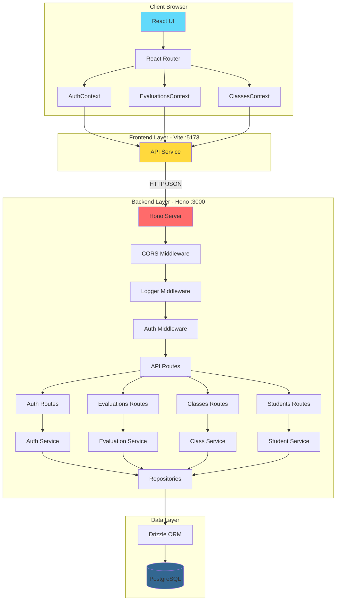

## Architecture en Couches

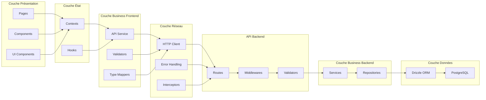

## Flux d'Authentification Détaillé

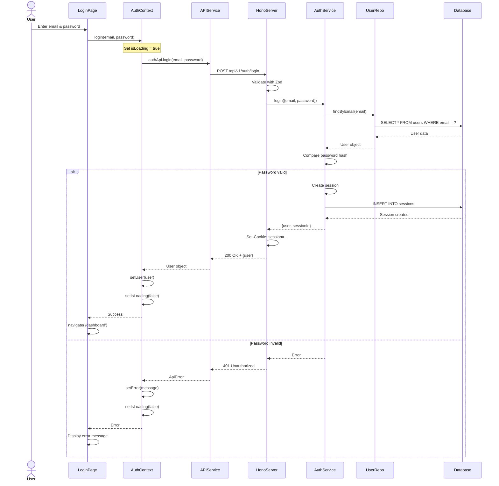

## Flux de Création d'Évaluation

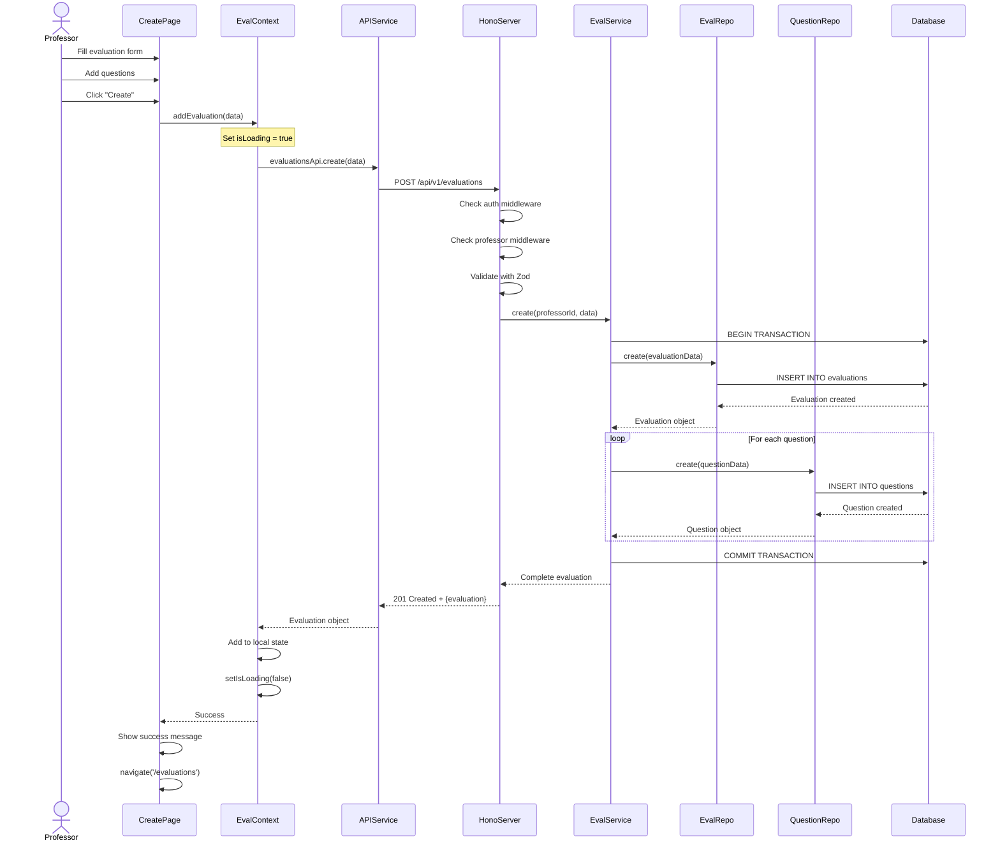

## Architecture des Contextes React

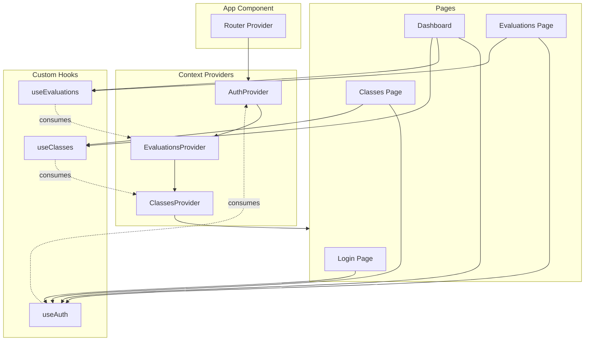

## Gestion des États

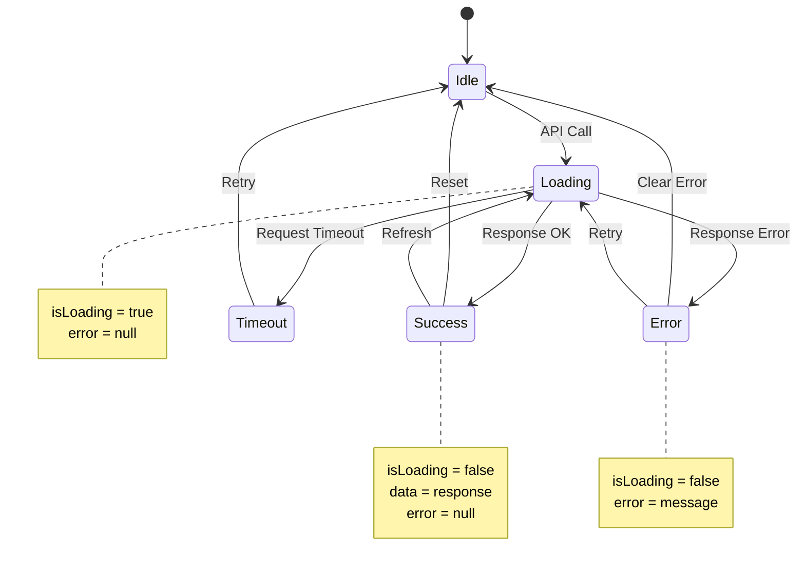

## Flux de Données - Évaluations

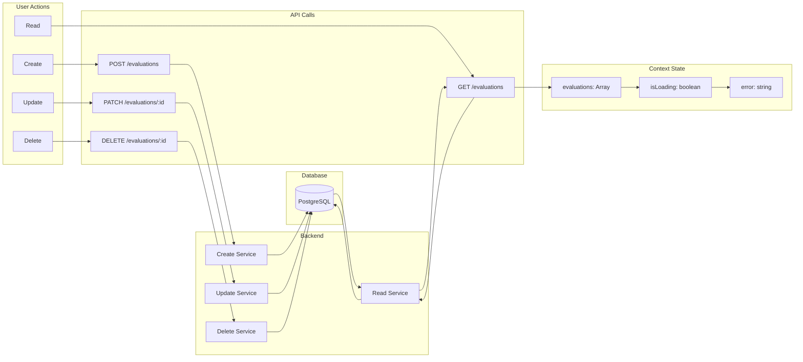

## Architecture de Sécurité

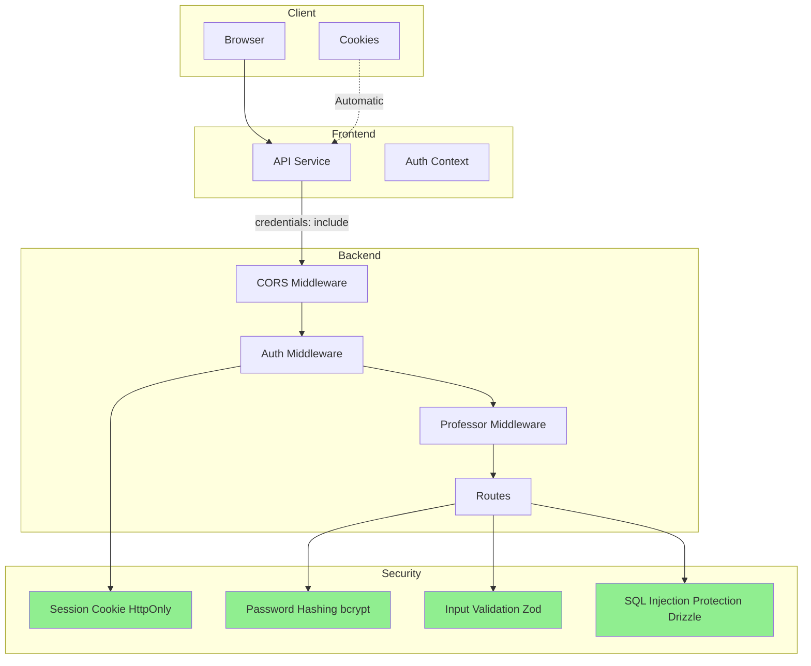

## Gestion des Erreurs

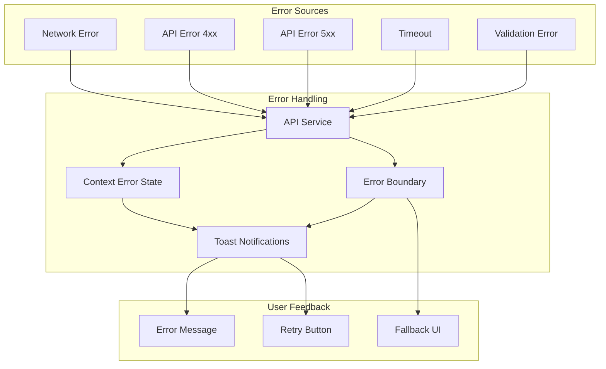

## Cycle de Vie d'une Requête

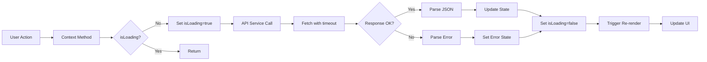

## Structure des Modules Backend

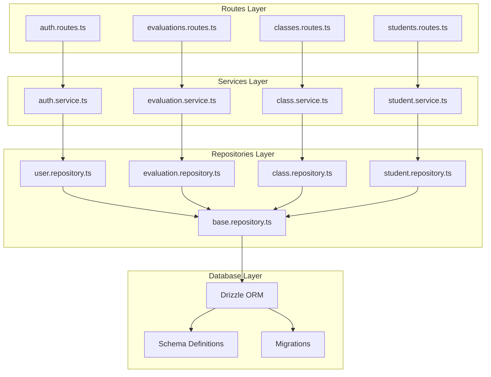

## Déploiement et Environnements

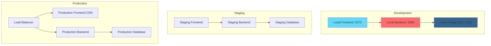

## Optimisations Futures

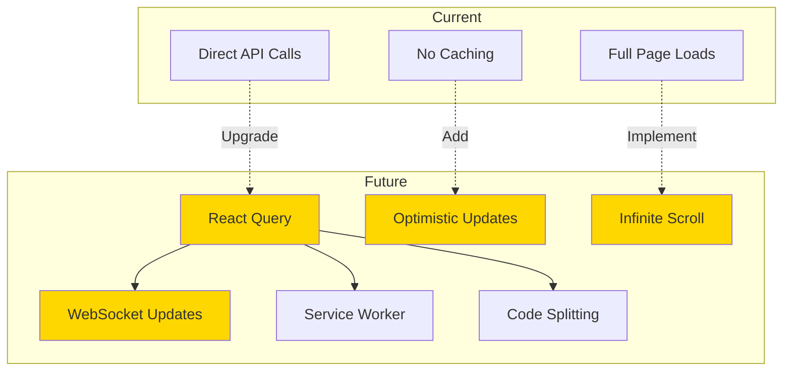
